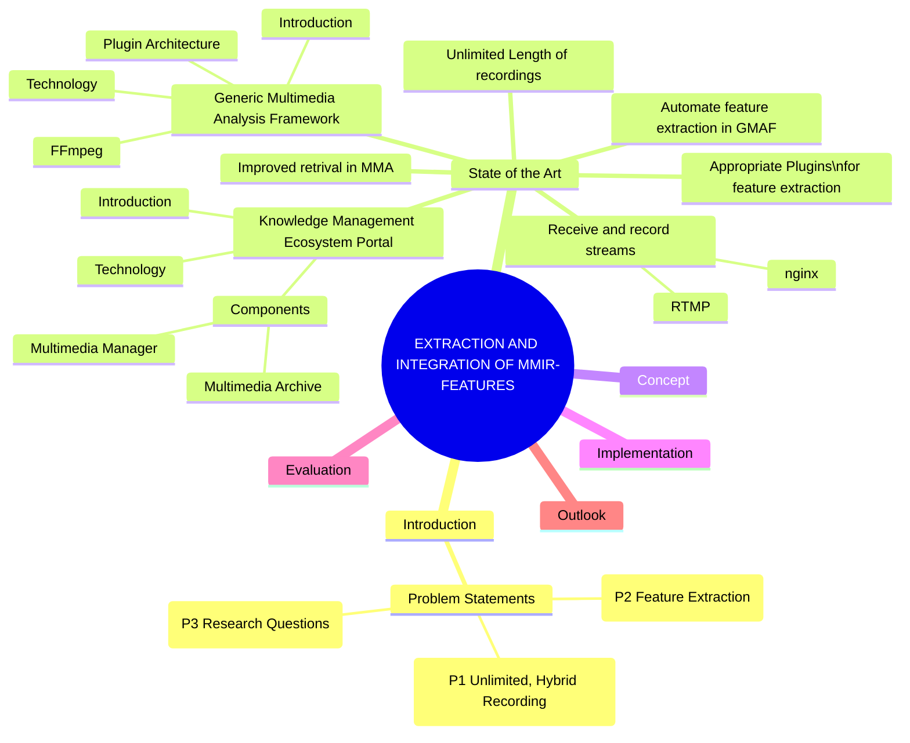

```mermaid
mindmap
  root((EXTRACTION AND INTEGRATION OF MMIR-FEATURES))
    Introduction
      Problem Statements
        (P1 Unlimited, Hybrid Recording)
        (P2 Feature Extraction)
        (P3 Research Questions)
    State of the Art
      Knowledge Management Ecosystem Portal
        Introduction
        Technology
        Components
          Multimedia Archive
          Multimedia Manager
      Generic Multimedia Analysis Framework
        Introduction
        Technology
        Plugin Architecture
        FFmpeg
      Receive and record streams
        RTMP
        nginx
      Unlimited Length of recordings
      Appropriate Plugins\nfor feature extraction
      Automate feature extraction in GMAF
      Improved retrival in MMA       
    Concept
    Implementation
    Evaluation
    Outlook

```
